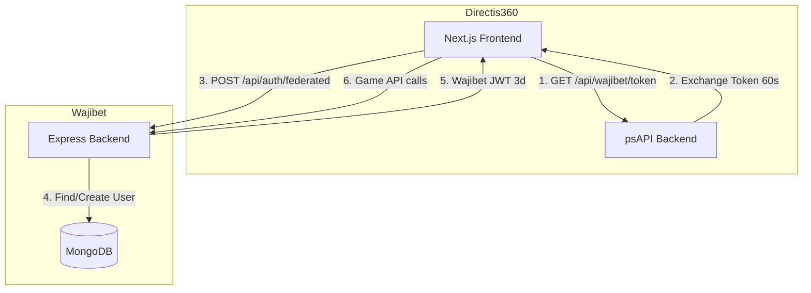
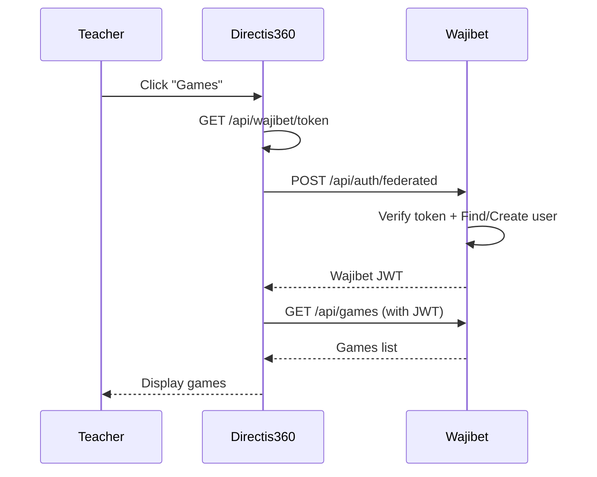
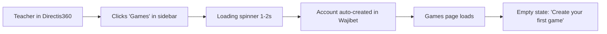
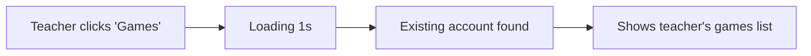
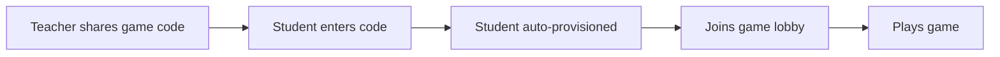
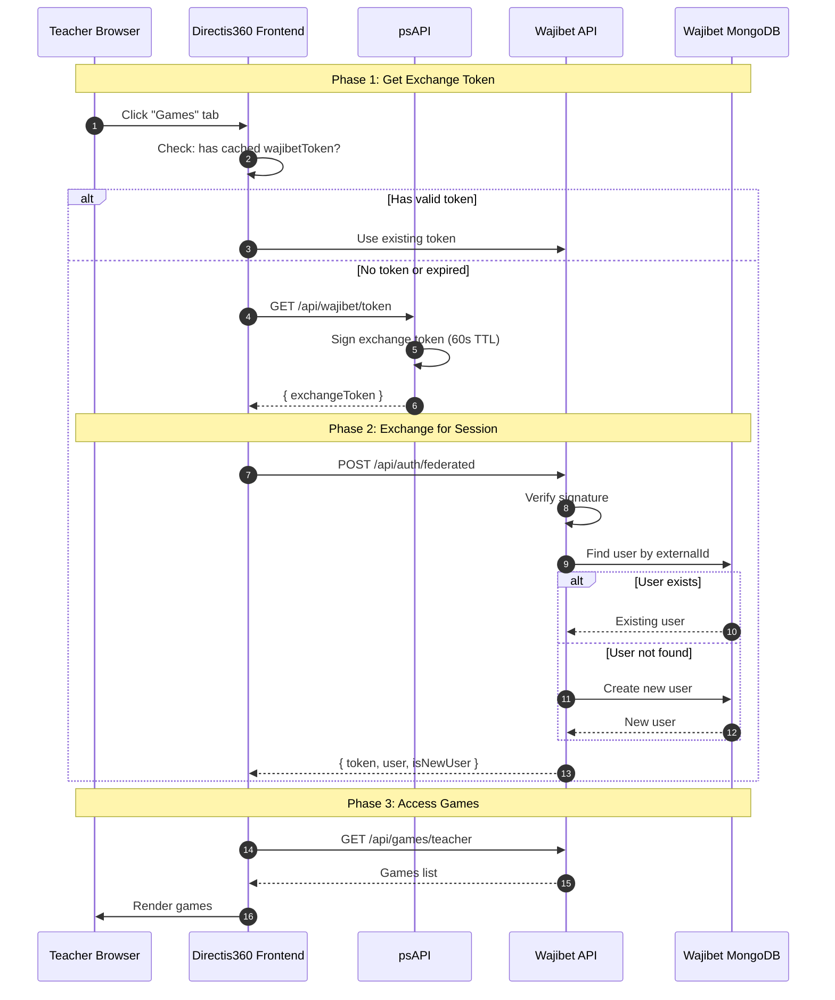
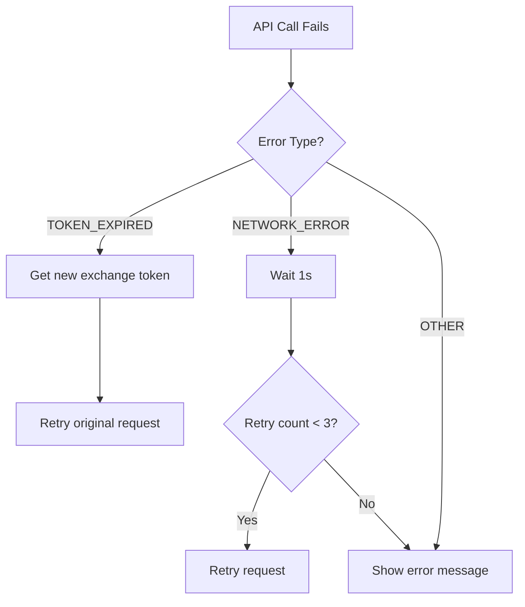
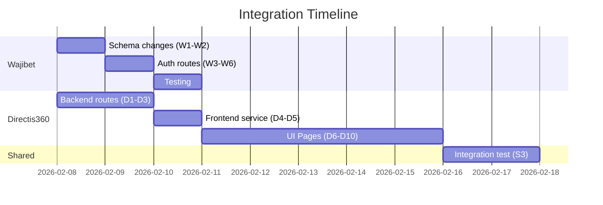

# Directis360 ↔ Wajibet Integration Plan

## Overview

| Item | Details |
|------|---------|
| **Goal** | Directis360 teachers access Wajibet games with auto account linking |
| **Approach** | Rebuild UI in Directis360, Wajibet = API + Database |
| **Auth** | Auto-Provisioning (automatic account creation) |

---

## Architecture

---

## Auth Flow

---

## User Experience Flow

### Teacher First Visit (New Account)

### Teacher Returns (Existing Account)

### Student Playing Game

---

## Authentication Flow (Detailed)

### Token Lifecycle

| Token | Created By | TTL | Purpose |
|-------|-----------|-----|---------|
| Directis JWT | psAPI login | 3 days | Auth in Directis360 |
| Exchange Token | psAPI `/wajibet/token` | **60 seconds** | One-time auth handoff |
| Wajibet JWT | Wajibet `/auth/federated` | 3 days | Auth in Wajibet API |

---

## Edge Cases & Error Handling

### Error Scenarios

| Error | Cause | User Sees | Solution |
|-------|-------|-----------|----------|
| `TOKEN_EXPIRED` | Exchange token > 60s | "Session expired" | Auto-retry: get new token |
| `TOKEN_INVALID` | Secret mismatch | "Auth failed" | Check FEDERATED_SECRET |
| `CORS_ERROR` | Origin not whitelisted | Network error | Add origin to Wajibet CORS |
| `WAJIBET_DOWN` | API unreachable | "Game service unavailable" | Retry with backoff |
| `DUPLICATE_EMAIL` | Email exists in Wajibet | Auth fails | Use externalId+email combo |

### Retry Flow

### Edge Cases

| Scenario | Handling |
|----------|----------|
| Teacher deleted from Directis360 | Wajibet account remains (orphaned) |
| Teacher changes name in Directis360 | Sync on next login |
| School deleted from Directis360 | Wajibet school remains |
| Same email in both systems | Match by externalId, not email |
| Teacher already has Wajibet account | Creates separate linked account |

---

## 🔵 Wajibet Team Tasks

| # | Task | File |
|---|------|------|
| W1 | Add `externalId`, `externalSource` to User model | `models/User.js` |
| W2 | Add `externalId`, `externalSource` to School model | `models/School.js` |
| W3 | Create federated auth route | `routes/federatedAuthRoutes.js` [NEW] |
| W4 | Register route in server | `server.js` |
| W5 | Configure CORS for Directis360 origin | `server.js` |
| W6 | Add `FEDERATED_SECRET` to env | `.env` |

---

## 🟢 Directis360 Team Tasks

| # | Task | File |
|---|------|------|
| D1 | Create exchange token route | `psAPI/routes/wajibet.routes.js` [NEW] |
| D2 | Register route in app | `psAPI/app.js` |
| D3 | Add `FEDERATED_SECRET`, `WAJIBET_API_URL` to env | `psAPI/.env` |
| D4 | Create wajibet service | `services/wajibetService.ts` [NEW] |
| D5 | Add `NEXT_PUBLIC_WAJIBET_API_URL` to env | `.env` |
| D6 | Create Games list page | `app/dashboard/teacher/games/page.tsx` [NEW] |
| D7 | Create Game page | `app/dashboard/teacher/games/create/page.tsx` [NEW] |
| D8 | Edit Game page | `app/dashboard/teacher/games/[id]/edit/page.tsx` [NEW] |
| D9 | Host Game page | `app/dashboard/teacher/games/[id]/host/page.tsx` [NEW] |
| D10 | Add "Games" to teacher sidebar | Layout component |

---

## 🤝 Shared Tasks

| # | Task |
|---|------|
| S1 | Generate `FEDERATED_SECRET` and share securely |
| S2 | Agree on exchange token payload structure |
| S3 | Joint integration testing |

---

## Timeline

---

## Environment Variables

| System | Variable | Value |
|--------|----------|-------|
| psAPI | `FEDERATED_SECRET` | Shared secret |
| psAPI | `WAJIBET_API_URL` | `http://localhost:5000` |
| Wajibet | `FEDERATED_SECRET` | Same shared secret |
| Wajibet | `DIRECTIS_ORIGIN` | `http://localhost:3000` |
| Directis360 Frontend | `NEXT_PUBLIC_WAJIBET_API_URL` | `http://localhost:5000` |
